# School District Analysis

## Overview
Maria, the chief data scientist for a city school district, has requested assistance for analyzing and reporting standardize test data reporting to determine and locate trends and patterns based upon the city’s schools testing proficiencies in the areas of math and reading. This information will aid in discussions focusing on strategic decisions at the school and district level. For the data collected, we will be analyzing data on student funding and their standardized test scores, in addition to data provided on the school level itself such as school type, size, and budget. 

In the initial examination of the data, we were able to determine the following metrics: 
-	High and low performing schools
-	Average math and reading scores by grade level
-	Test scores based on school spending
-	Test scores based on school size
-	Test scores based on school type

This time around, the school board has notified Maria that the test scores for the ninth grade students at Thomas High School had been altered. Therefore, Maria has asked us to revisit the original analysis and replace math and reading scores for Thomas High School with “NaNs” while keeping the rest of the data intact. Once they have been replaced, the school district analysis was repeated in determine how the new data alterations affected the overall analysis.  

Ultimately, this data wrangling, cleaning, and analysis will assist the school board regarding future school budgets and priorities of the fifteen schools that data was collected from.

## Tools Used:
- Python
- Pandas
- Jupyter Notebook

## Objectives:
- Open Jupyter Notebook files from local directories using a development environment.
- Read an external CSV file into a DataFrame.
- Format a DataFrame column.
- Determine data types of row values in a DataFrame.
- Retrieve data from specific columns of a DataFrame.
- Merge, filter, slice, and sort a DataFrame.
- Use multiple methods to perform a function on a DataFrame.
- Perform mathematical calculations on columns of a DataFrame or Series.

## Results

### District Summary

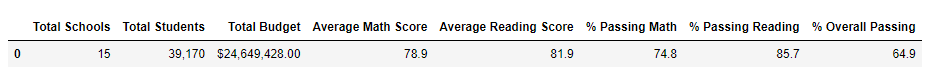

With replacing the ninth-graders scores at Thomas High School, we are able to see that the district average score for math and the percentage of students passing math, reading, and overall, has decreased in comparison to the original analysis. By excluding the data of the ninth graders, the DataFrame depicts the scores in these categories to have dropped. Not drastic shifts of the data but enough to demonstrate that the district’s data of all 15 schools dropped by the minutest tenth of a decimal. 

### School Summary

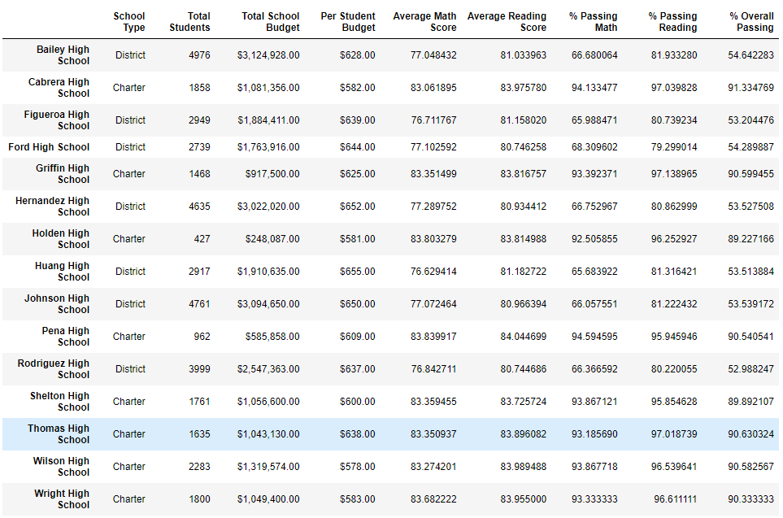

Reviewing the per school summary dataframe, we can see that the results in all categories for Thomas High School have all decreased in comparison to the other 14 schools. The removal of the ninth grade students test scores caused the averages and rates of passing in each subject and overall school standing to decrease. 

### The Effect of Replacing Test Scores Regarding Performance

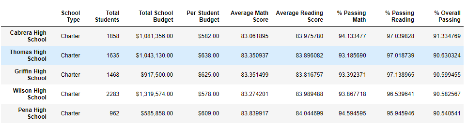

In the area of performance, Thomas High School continues to rank among the top five schools in the district in terms of the school’s rate of Overall Passing. As mentioned previous, the averages for math and reading and the passing rates of these subjects declined slightly, but in terms of ranking, it appears to have had no major impact to the school’s standing in comparison to the whole district. Essentially, replacing the data did not have significant impact on Thomas High School’s performance. 

### Replacing the ninth-grade scores affected the following:

- Math and reading scores (respectively) by grade

Original Analysis:

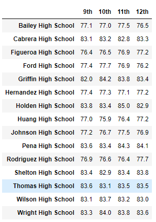

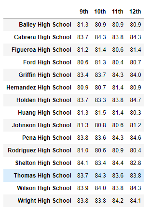

Updated Analysis:

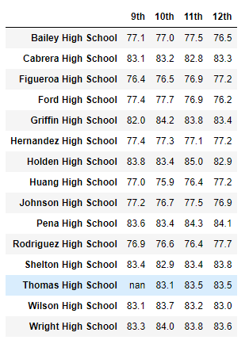

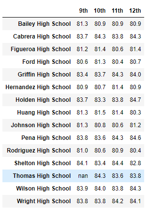

As shown on the table, the scores for the ninth graders at Thomas High School were removed and therefore not taken into account anymore. The original data analysis scores that their reading score was an average of 83.7 and their math score average was 83.6. 

-	Scores by school spending
	
Original Analysis:

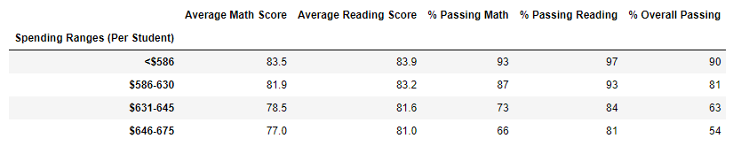

Updated Analysis:

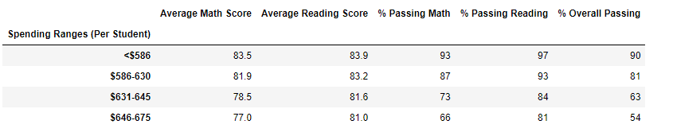

As shown by the table, there seems to be no effect with replacing the ninth-graders scores with school spending. Therefore, placing the results of one grader had no impact the scores by school spending. 

-	Scores by school size

Original Analysis:

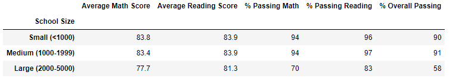

Updated Analysis:

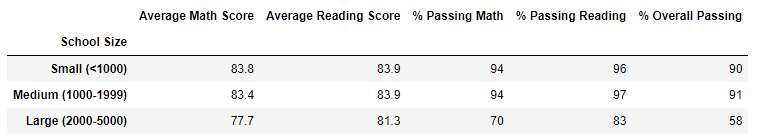

Comparing the scores by school of the original data and the new data, it can be seen that there is no effect on the scores of the school size based on the replacement of Thomas High School ninth grade class.

-	Scores by school type

Original Analysis:

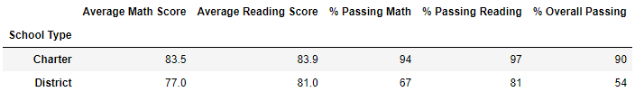

Updated Analysis:

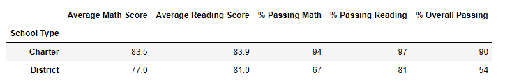

Lastly, comparing the scores by school type demonstrates no change in the data when comparing the original dataset and the one with the altered grades of the ninth grade students at Thomas High School. The replacement of their grades was inconsequential to the based on comparing Charter and District schools. 

## Summary 

There are four distinct changes in the updated school district analysis that were noticed after conducting the changes in the ninth graders results at Thonas High School. First, the overall passing rate for Thomas High School has shifted, originally having a passing rate of 91% to 65%. A significant change and decrease in the overall passing rate for the school. Secondly, the data at the ninth grade level for Thomas High School reflects “NaN”, after originally numerical averages for both math and reading scores. It is the only school in the dataset to have results replaced and alter its overall school and grade performance. There were also shifts in the averages of the math and reading scores, causing the rate in both subject fields to fall slightly. Lastly, the overall district rates also shifted as a result of the changes in the data, caused a slight decrease in all of the rates in every category that encompassesd the 15 schools. 
